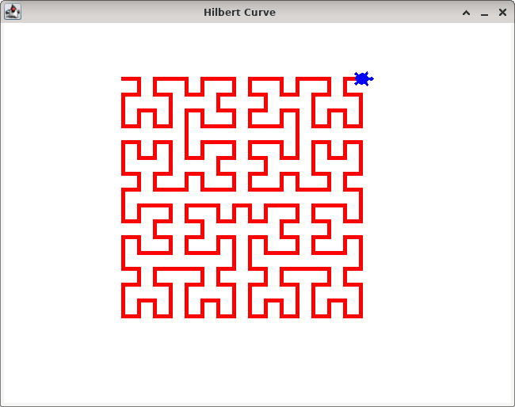
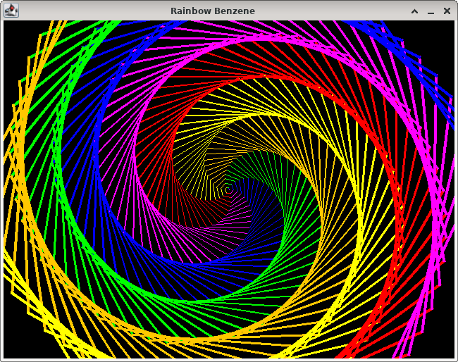
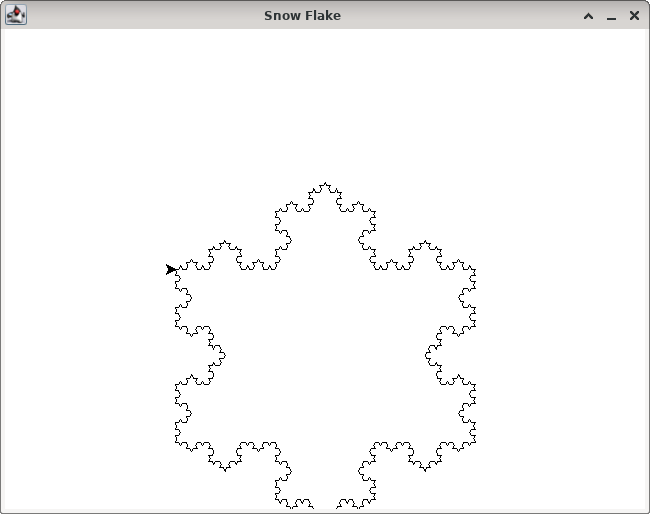

# JTurtle
Tortuga tipo "Turtle Pyhton" en Java

```java
package test;

import java.awt.Color;
import java.awt.Dimension;
import java.awt.Font;
import java.awt.event.KeyEvent;

import rcr.turtle.Turtle;
import rcr.turtle.World;

// tomado de https://www.geeksforgeeks.org/turtle-programming-python/
public class RainbowBenzene {
    World world;
    Turtle t;

    public RainbowBenzene() {
        world = new World(new Dimension(800, 600), "Rainbow Benzene", Color.BLACK);
        t = world.createTurtle();

        String path = world.getRealPath(this, "./resources");
        world.setBgImage(path + "/Grid 800x600.png");
    }

    public void run() {
        Color[] colors = { Color.RED, Color.MAGENTA, Color.BLUE, Color.GREEN, Color.ORANGE, Color.yellow };
        t.setPenDown();
        for (int x = 0; x < 360; x++) {
            t.setPenColor(colors[x % 6]);
            t.setPenSize(x / 100 + 1);
            t.forward(x);
            t.left(59);
        }
        t.setPenUp();

        t.setPosition(-110, -220);
        t.setPenColor(Color.BLACK);
        t.write("Presione 'ESC' para finalizar", "Arial", 20, Font.PLAIN);

        t.setPosition(0, -250);
        t.setHeading(90);

        world.waitForKey(KeyEvent.VK_ESCAPE);
        world.bye();

    }

    public static void main(String[] args) {
        RainbowBenzene test = new RainbowBenzene();
        test.run();
    }
}
```







